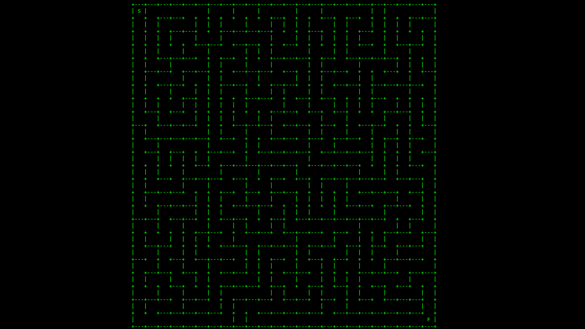

# Maze Generator
Generates a 2-D maze using a recursive backtracking algorithm.

## Prerequisites

Before you can run this program, ensure that you have the following software installed and functional:
* Windows XP, Windows Server 2003, Windows Vista, Windows Server 2008, Windows 7, Windows 8, Windows 8.1, or Windows 10 OS.
* C++11 compiler.

## Running
1. Download the source code from this repository.
2. Compile and run the application.
3. When prompted, enter the size of the maze you wish to generate and press <kbd>enter</kbd>. The minimum maze size is 2. Note: If the size of the maze exceeds the size of the terminal window, the maze will be generated but will not print to the screen properly.
4. The application will print the newly generated maze to the console. When you wish to exit the application, press <kbd>enter</kbd>.

## File Summaries

Bellow is the a list of each program file and a brief explanation of its role:

* [__Maze_Generator.cpp:__](Maze_Generator.cpp) Defines the entry point for the application.
* [__Maze.h:__](Maze.h) Contains declarations for the `Maze` class.
* [__Maze.cpp:__](Maze.cpp) Contains definitions for the `Maze` class.
* [__Cell.h:__](Cell.h) Contains declarations for `Cell` struct.
* [__Cell.cpp:__](Cell.cpp) Contains definitions for `Cell` struct.
* [__stdafx.h:__](stdafx.h) Used to include Windows precompiled headers.
* [__stdafx.cpp:__](stdafx.cpp) Includes [__stdafx.h:__](stdafx.h).

## Authors

* [**Ethan Genser**](https://github.com/Ethan-Genser) - *Creator*

## License

This project is licensed under the Apache License Version 2.0 - see the [LICENSE](LICENSE) file for details.
